  <picture>
    <source media="(prefers-color-scheme: dark)" srcset="assets/dark.svg">
    <source media="(prefers-color-scheme: light)" srcset="assets/light.svg">
    
  </picture>

    

  <!-- Social Badges -->
  
  &nbsp;
  
  &nbsp;
  

 

---

### 👋 Hello World, I'm B.V.S. Subrahmanyam

I am an **Artificial Intelligence & Machine Learning undergraduate student** based in Andhra Pradesh, India, passionate about building full-stack web applications, exploring machine learning models, and engineering practical software solutions.

- 🎓 **Education:** B.Tech in Artificial Intelligence & Machine Learning
- 📍 **Location:** Andhra Pradesh, India
- 💡 **Interests:** Full-Stack Web Development, Retrieval-Augmented Generation (RAG), Machine Learning, Software Engineering
- 🌱 **Currently Exploring:** Advanced agentic RAG workflows, LangChain, React, and scalable backend architecture
- 🌐 **Portfolio:** *Portfolio coming soon*

---

### 🛠️ Technical Stack

<table>
  <tr>
    <td width="20%" valign="top"><strong>Languages</strong></td>
    <td>
      
      
      
      
    </td>
  </tr>
  <tr>
    <td valign="top"><strong>Frontend</strong></td>
    <td>
      
      
      
      
    </td>
  </tr>
  <tr>
    <td valign="top"><strong>Backend</strong></td>
    <td>
      
      
      
    </td>
  </tr>
  <tr>
    <td valign="top"><strong>AI / ML &amp; Data</strong></td>
    <td>
      
      
      
      
    </td>
  </tr>
  <tr>
    <td valign="top"><strong>Databases</strong></td>
    <td>
      
      
    </td>
  </tr>
  <tr>
    <td valign="top"><strong>Tools &amp; Workflow</strong></td>
    <td>
      
      
      
      
    </td>
  </tr>
</table>

---

### 🚀 Featured Projects

#### 📄 [DocMind AI — Universal PDF RAG Agent](https://github.com/subbu957/doc-mind-ai)
> Full-stack Retrieval-Augmented Generation (RAG) agent application for intelligent PDF interaction.
- **Key Features:** Universal PDF text extraction, ChromaDB vector indexing, grounded source citations with physical page numbers, practice question/MCQ generator, and safe math calculation evaluator.
- **Tech Stack:** Python, FastAPI, React 18, Vite, Tailwind CSS, LangChain, PyMuPDF, ChromaDB, HuggingFace & Gemini APIs.

#### 📊 [Student SGPA & CGPA Calculator](https://github.com/subbu957)
> Interactive academic performance calculator designed for university students to track semester grade points and cumulative scores accurately.
- **Key Features:** Grade-point mapping, semester credit weighting, and instant CGPA prediction.
- **Tech Stack:** JavaScript, HTML5, CSS3.

---

### 📈 GitHub Telemetry & Activity

  
  &nbsp;
  

    

  

---

### 🐍 Contribution Graph

<picture>
  <source media="(prefers-color-scheme: dark)" srcset="https://raw.githubusercontent.com/subbu957/subbu957/output/github-snake-dark.svg">
  <source media="(prefers-color-scheme: light)" srcset="https://raw.githubusercontent.com/subbu957/subbu957/output/github-snake.svg">
  
</picture>

---

### 📬 Connect With Me

- **LinkedIn:** [linkedin.com/in/subrhamanyam-bhattaram-658656303](https://www.linkedin.com/in/subrhamanyam-bhattaram-658656303)
- **Email:** [bvssubbu2005@gmail.com](mailto:bvssubbu2005@gmail.com)
- **GitHub:** [github.com/subbu957](https://github.com/subbu957)

  Built by <b>B.V.S. Subrahmanyam</b> • Updated 2026

